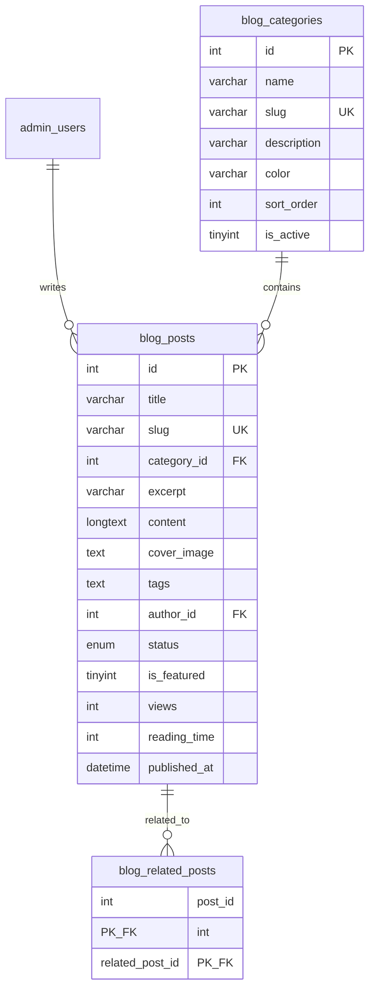
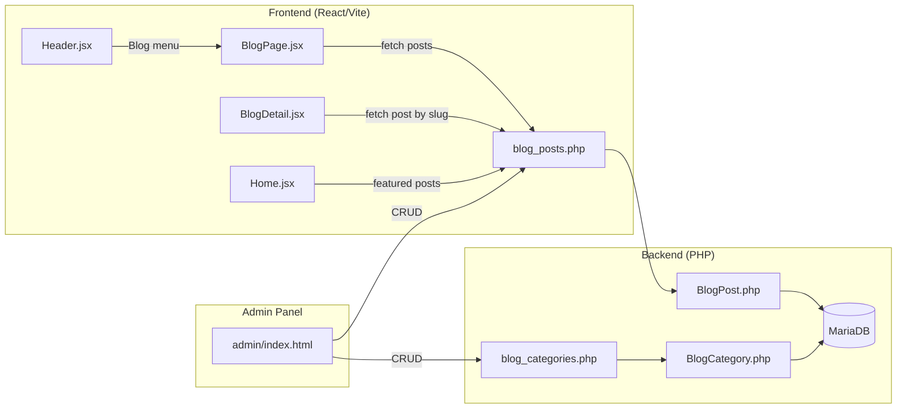

# Blog System — Implementation Plan

ระบบ Blog สำหรับเว็บไซต์ Indo Smile South Services เพื่อเผยแพร่บทความเกี่ยวกับทัวร์, สถานที่ท่องเที่ยว, เคล็ดลับการเดินทาง, และข่าวสารต่าง ๆ

## สรุปภาพรวม Tech Stack

| Layer | Technology | หมายเหตุ |
|-------|-----------|----------|
| **Frontend** | React (Vite) + TailwindCSS v4 | ตาม stack ปัจจุบัน |
| **Backend API** | PHP (Vanilla) + PDO | ตามรูปแบบ `backend/api/tours.php` ที่มีอยู่ |
| **Database** | MariaDB 10.6 | DB `sevensmile_indosmile` บน Plesk |
| **Admin CMS** | Vanilla HTML/JS + TailwindCSS CDN | ตามรูปแบบ `backend/admin/` ที่มีอยู่ |
| **File Upload** | PHP upload API (มีอยู่แล้ว) | ใช้ `backend/api/upload.php` เดิม |

---

## User Review Required

> [!IMPORTANT]
> **ฟีเจอร์ Blog ที่แนะนำ** — กรุณาตรวจสอบว่าฟีเจอร์เหล่านี้ตรงกับความต้องการหรือไม่:
> 1. **Blog Categories** (หมวดหมู่) — เช่น Travel Tips, Destination Guides, Company News
> 2. **Blog Tags** (แท็ก) — เช่น Phuket, Snorkeling, Budget Travel
> 3. **Featured Blog Posts** — โพสต์เด่นแสดงที่ homepage
> 4. **Rich Text Content** — รองรับข้อความ HTML สำหรับเนื้อหาบทความ
> 5. **Cover Image + Gallery** — รูปหน้าปกและรูปในบทความ
> 6. **SEO Fields** — Meta title, Meta description, OG Image
> 7. **Draft/Published Status** — ร่าง vs เผยแพร่
> 8. **Reading Time** — ประมาณเวลาอ่าน (คำนวณอัตโนมัติ)
> 9. **Related Posts** — แสดงบทความที่เกี่ยวข้อง

> [!WARNING]
> **ไม่รวมในแผนนี้** (จะเพิ่มภายหลังได้):
> - ระบบ Comment จากผู้อ่าน
> - ระบบสมัครรับข่าว (Newsletter)
> - Social media share counters
> - Multi-language support

---

## Proposed Changes

### 1. Database Layer

#### [NEW] Blog Migration SQL

สร้าง 3 ตารางใหม่ใน database `sevensmile_indosmile`:

**ตาราง `blog_categories`**
```sql
CREATE TABLE IF NOT EXISTS `blog_categories` (
  `id` INT(11) NOT NULL AUTO_INCREMENT,
  `name` VARCHAR(100) NOT NULL,
  `slug` VARCHAR(120) NOT NULL UNIQUE,
  `description` VARCHAR(500) NULL,
  `color` VARCHAR(7) DEFAULT '#010048',       -- HEX color for UI badge
  `sort_order` INT(11) DEFAULT 0,
  `is_active` TINYINT(1) DEFAULT 1,
  `created_at` TIMESTAMP DEFAULT CURRENT_TIMESTAMP,
  `updated_at` TIMESTAMP DEFAULT CURRENT_TIMESTAMP ON UPDATE CURRENT_TIMESTAMP,
  PRIMARY KEY (`id`),
  INDEX `idx_slug` (`slug`),
  INDEX `idx_is_active` (`is_active`)
) ENGINE=InnoDB DEFAULT CHARSET=utf8mb4 COLLATE=utf8mb4_unicode_ci;
```

**ตาราง `blog_posts`**
```sql
CREATE TABLE IF NOT EXISTS `blog_posts` (
  `id` INT(11) NOT NULL AUTO_INCREMENT,
  `title` VARCHAR(300) NOT NULL,
  `slug` VARCHAR(350) NOT NULL UNIQUE,
  `category_id` INT(11) NULL,
  `excerpt` VARCHAR(500) NULL,              -- สรุปสั้น ๆ สำหรับ card
  `content` LONGTEXT NOT NULL,              -- HTML content
  `cover_image` TEXT NULL,                  -- URL รูปหน้าปก
  `gallery_images` TEXT NULL,               -- JSON array of image URLs
  `tags` TEXT NULL,                         -- JSON array of tags e.g. ["phuket","travel"]
  `author_id` INT(11) NULL,                 -- FK → admin_users
  `author_name` VARCHAR(100) NULL,          -- Display name (fallback)
  `status` ENUM('draft','published','archived') DEFAULT 'draft',
  `is_featured` TINYINT(1) DEFAULT 0,
  `views` INT(11) DEFAULT 0,
  `reading_time` INT(11) DEFAULT 0,         -- minutes (auto-calculated)
  `meta_title` VARCHAR(200) NULL,           -- SEO
  `meta_description` VARCHAR(500) NULL,     -- SEO
  `published_at` DATETIME NULL,             -- วันที่เผยแพร่ (ตั้งเองได้)
  `created_at` TIMESTAMP DEFAULT CURRENT_TIMESTAMP,
  `updated_at` TIMESTAMP DEFAULT CURRENT_TIMESTAMP ON UPDATE CURRENT_TIMESTAMP,
  PRIMARY KEY (`id`),
  INDEX `idx_slug` (`slug`),
  INDEX `idx_category_id` (`category_id`),
  INDEX `idx_status` (`status`),
  INDEX `idx_is_featured` (`is_featured`),
  INDEX `idx_published_at` (`published_at`),
  FOREIGN KEY (`category_id`) REFERENCES `blog_categories`(`id`) ON DELETE SET NULL,
  FOREIGN KEY (`author_id`) REFERENCES `admin_users`(`id`) ON DELETE SET NULL
) ENGINE=InnoDB DEFAULT CHARSET=utf8mb4 COLLATE=utf8mb4_unicode_ci;
```

**ตาราง `blog_related_posts`** (Many-to-Many)
```sql
CREATE TABLE IF NOT EXISTS `blog_related_posts` (
  `post_id` INT(11) NOT NULL,
  `related_post_id` INT(11) NOT NULL,
  PRIMARY KEY (`post_id`, `related_post_id`),
  FOREIGN KEY (`post_id`) REFERENCES `blog_posts`(`id`) ON DELETE CASCADE,
  FOREIGN KEY (`related_post_id`) REFERENCES `blog_posts`(`id`) ON DELETE CASCADE
) ENGINE=InnoDB DEFAULT CHARSET=utf8mb4 COLLATE=utf8mb4_unicode_ci;
```

#### แผนภาพ ER Diagram



---

### 2. Backend API Layer

#### [NEW] [blog_posts.php](file:///d:/INDO%20SMILE%20SOUTH%20SERVICES/Web/official-web/backend/api/blog_posts.php)

API endpoint สำหรับ blog posts ตาม pattern เดียวกับ `tours.php`:

| Method | Endpoint | Auth | Description |
|--------|----------|------|-------------|
| `GET` | `?slug=xxx` | ❌ | ดึง post ตาม slug (public, เพิ่ม view count) |
| `GET` | `?id=xxx` | ❌ | ดึง post ตาม ID |
| `GET` | (list) | ❌ | ดึง posts ทั้งหมด + filters (category, tag, search, featured, status) + pagination |
| `GET` | `?featured=1` | ❌ | ดึง featured posts สำหรับ homepage |
| `POST` | | ✅ Admin | สร้าง post ใหม่ |
| `PUT` | `?id=xxx` | ✅ Admin | อัพเดท post |
| `DELETE` | `?id=xxx` | ✅ Admin | ลบ post |

#### [NEW] [blog_categories.php](file:///d:/INDO%20SMILE%20SOUTH%20SERVICES/Web/official-web/backend/api/blog_categories.php)

| Method | Endpoint | Auth | Description |
|--------|----------|------|-------------|
| `GET` | (list) | ❌ | ดึง categories ทั้งหมด + post count |
| `POST` | | ✅ Admin | สร้าง category |
| `PUT` | `?id=xxx` | ✅ Admin | อัพเดท category |
| `DELETE` | `?id=xxx` | ✅ Admin | ลบ category |

#### [NEW] [BlogPost.php](file:///d:/INDO%20SMILE%20SOUTH%20SERVICES/Web/official-web/backend/models/BlogPost.php)

Model class สำหรับ blog_posts (ตาม pattern `Tour.php`):
- `getAll($filters)` — list + filter + pagination
- `getById($id)` — ดึง post ตาม ID
- `getBySlug($slug)` — ดึง post ตาม slug + increment views
- `create($data)` — สร้าง post + auto-calculate reading_time
- `update($id, $data)` — อัพเดท post
- `delete($id)` — ลบ post
- `getRelated($postId, $limit)` — ดึง related posts (same category + tags)

#### [NEW] [BlogCategory.php](file:///d:/INDO%20SMILE%20SOUTH%20SERVICES/Web/official-web/backend/models/BlogCategory.php)

Model class สำหรับ blog_categories

---

### 3. Admin CMS Panel

#### [MODIFY] [index.html](file:///d:/INDO%20SMILE%20SOUTH%20SERVICES/Web/official-web/backend/admin/index.html)

- เพิ่มเมนู **"Blog"** ใน sidebar (ข้าง Hotels)
- เพิ่ม **Blog Page** section ใน content area
- เพิ่ม **Blog Modal** (Create/Edit) พร้อม tabs:
  - **Content** — Title, Excerpt, Rich Text Editor (จะใช้ textarea + HTML preview หรือ TinyMCE/QuillJS)
  - **Media** — Cover image upload, Gallery images
  - **Settings** — Category, Tags, Status, Featured toggle, Published date, SEO fields

#### [MODIFY] [app.js](file:///d:/INDO%20SMILE%20SOUTH%20SERVICES/Web/official-web/backend/admin/app.js)

- เพิ่ม Blog management functions (CRUD)
- Blog posts table with search + category filter
- Blog categories management (simple CRUD modal)

---

### 4. Frontend (React)

#### [NEW] [BlogPage.jsx](file:///d:/INDO%20SMILE%20SOUTH%20SERVICES/Web/official-web/src/components/BlogPage.jsx)

หน้ารวม Blog (listing page) `/blog`:

**Layout & Features:**
- Hero section ด้านบน พร้อม heading "Our Blog" + subheading
- **Featured Post** — การ์ดขนาดใหญ่แสดง featured post ล่าสุด
- **Category Filter** — ปุ่ม pills filter ตาม category
- **Blog Grid** — 3 columns grid แสดง blog cards
- **Pagination** — Load More หรือ numbered pagination
- **Sidebar (optional)** — Categories list, Popular posts, Tags cloud

**Design Concept:**
- สไตล์เดียวกับ Inbound Tours page (navy/gold theme)
- Card design: Cover image, Category badge, Title, Excerpt, Date, Reading time
- Hover effects: subtle scale + shadow transition
- Responsive: 3 cols → 2 cols → 1 col

#### [NEW] [BlogDetail.jsx](file:///d:/INDO%20SMILE%20SOUTH%20SERVICES/Web/official-web/src/components/BlogDetail.jsx)

หน้ารายละเอียดบทความ `/blog/:slug`:

**Layout & Features:**
- Full-width cover image with overlay gradient
- Back to Blog link
- Category badge + Published date + Reading time + Views count
- Article title (large heading)
- Author info
- **Article Content** — rendered HTML content
- **Tags** — clickable tag pills
- **Related Posts** — grid 3 cards ของบทความที่เกี่ยวข้อง
- **Share buttons** — Facebook, Twitter, LINE, Copy link
- **Back to top** button

**Design Concept:**
- Premium editorial layout คล้าย Medium/Substack
- Max-width prose content (700px centered)
- Typography optimized for reading (Inter/Be Vietnam Pro)
- Smooth scroll behavior

#### [NEW] [BlogCard.jsx](file:///d:/INDO%20SMILE%20SOUTH%20SERVICES/Web/official-web/src/components/BlogCard.jsx)

Reusable blog card component ที่ใช้ใน BlogPage + HomePage (featured posts):
- Cover image with aspect ratio
- Category color badge
- Title (2-line clamp)
- Excerpt (3-line clamp)
- Footer: Date + Reading time

#### [MODIFY] [Header.jsx](file:///d:/INDO%20SMILE%20SOUTH%20SERVICES/Web/official-web/src/components/Header.jsx)

- เพิ่ม menu item `{ name: "Blog", path: "/blog" }` ใน `menuItems` array

#### [MODIFY] [App.jsx](file:///d:/INDO%20SMILE%20SOUTH%20SERVICES/Web/official-web/src/App.jsx)

- เพิ่ม routes:
  - `/blog` → `<BlogPage />`
  - `/blog/:slug` → `<BlogDetail />`

#### [MODIFY (Optional)] [Home.jsx](file:///d:/INDO%20SMILE%20SOUTH%20SERVICES/Web/official-web/src/components/Home.jsx)

- เพิ่ม "Latest from Our Blog" section แสดง 3 featured posts ล่าสุด

---

### 5. Database Migration File

#### [NEW] [add_blog_tables.sql](file:///d:/INDO%20SMILE%20SOUTH%20SERVICES/Web/official-web/backend/migrations/add_blog_tables.sql)

ไฟล์ SQL migration สำหรับ run บน server เพื่อสร้างตาราง + insert default categories

**Default Categories ที่แนะนำ:**
| Name | Slug | Color |
|------|------|-------|
| Travel Tips | travel-tips | #4F46E5 (indigo) |
| Destination Guides | destination-guides | #059669 (emerald) |
| Company News | company-news | #D97706 (amber) |
| Culture & Food | culture-food | #DC2626 (red) |
| Travel Stories | travel-stories | #7C3AED (violet) |

---

## Architecture Flow



---

## Open Questions

> [!IMPORTANT]
> **Rich Text Editor สำหรับ Admin:**
> ต้องการใช้ editor แบบไหนในหน้า Admin?
> 1. **Textarea + HTML** — เขียน HTML ตรง ๆ (Simple แต่ไม่ user-friendly)
> 2. **TinyMCE** — WYSIWYG editor ฟรี (CDN) ฟีเจอร์ครบ, drag & drop images
> 3. **Quill.js** — Lightweight WYSIWYG editor (CDN)
>
> ผมแนะนำ **TinyMCE** เพราะรองรับ image upload, table, formatting ครบถ้วน

> [!IMPORTANT]
> **Blog แสดงบน Homepage ด้วยไหม?**
> จะเพิ่ม section "Latest from Our Blog" แสดง 3 posts ล่าสุดบนหน้า Homepage ด้วยไหมครับ?

> [!IMPORTANT]
> **ภาษาของบทความ:**
> Blog จะเขียนเป็นภาษาอังกฤษ, ไทย, หรือทั้งสอง? (เพื่อออกแบบ font/typography ให้เหมาะสม)

---

## Verification Plan

### Automated Tests
1. **Database** — Run migration SQL on test database, verify tables created
2. **Backend API** — Test CRUD endpoints using curl/Postman:
   - Create category → Create post → List posts → Get by slug → Update → Delete
3. **Frontend** — `npm run dev` แล้วเปิดดู blog pages ใน browser
4. **Build Test** — `npm run build` เช็คว่า compile สำเร็จ

### Manual Verification
1. Admin Panel — Login → Blog menu → Create/Edit/Delete blog posts
2. Frontend — เปิดหน้า `/blog` ดู listing → คลิกเข้า detail page
3. Responsive — ทดสอบ mobile/tablet/desktop
4. SEO — ตรวจสอบ meta tags ใน head
